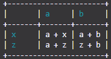

# TableIt

## <span style="color:#22b6e3">Installation</span>
Installing this library is super easy! There are two ways you can do it.

* Install the _<span style="color:#bac21b">TableIt.py</span>_ file into each of you project's directories. <span style="color:#f23838"> **This solution doesn't allow repeated use, you have to do it for each project.**</span>

* Install the _<span style="color:#bac21b">TableIt.py</span>_ file into your <span style="color:#bac21b">\<Directory to python\>\Python\Python38-32\Lib\site-packages</span> path (note that your path will most likely have a different version of python and your python installation may come from a different place). <span style="color:#0ff26a">**This solution allows repeated use, you only have to do it once.**</span>

## <span style="color:#22b6e3">Intro</span>
TableIt is a free open-source python library that prints arrays as tables to the console.

## <span style="color:#22b6e3">Example</span>
This library is extremly simple, to use it make a list of lists, each inner list should be a row. The amount of elements in each inner list needs to be uniform.

For example,
```python
table = [
    [1, 2, 3.0],
    [5.0, 400, 1],
    ["Hi", 3, 2]
]
```

Will print:
```
+-----------------+
| 1   | 2   | 3.0 |
| 5.0 | 400 | 1   |
| Hi  | 3   | 2   |
+-----------------+
```

It can also print:
```
+-----------------+
| 1   | 2   | 3.0 |
+-----+-----+-----+
| 5.0 | 400 | 1   |
| Hi  | 3   | 2   |
+-----------------+
```

It's all your choice.

## <span style="color:#22b6e3">Using TableIt</span>
To use TableIt, simply import TableIt after following the installation instructions from above
```python
import TableIt
```

Then, create the list you would like to print
```python
myList = [
    ["Name", "Email"],
    ["Richard", "richard@fakeemail.com"],
    ["Tasha", "tash@fakeemail.com"]
]
```

Then simply print it! Choose whether or not you would like field names (use <span style="color:#f79914">`True`</span> if so, don't put anything if not (don't include `useFieldNames` at all) because it defaults to `False`). 

```python
# NOTE: useFieldNames defaults to False, so, if you don't type useFieldNames=True it automatically goes to False
TableIt.printTable(myList, useFieldNames=True)
```

As output, you get:

```
+-----------------------------------------------+
| Name                  | Email                 |
+-----------------------+-----------------------+
| Richard               | richard@fakeemail.com |
| Tasha                 | tash@fakeemail.com    |
+-----------------------------------------------+
```

If you didn't want to use field names then you would only have to write:

```python
TableIt.printTable(myList)
```

Another example:
```python
myList = [
    ["", "a", "b"],
    ["x", "a + x", "a + b"],
    ["z", "a + z", "z + b"]
]
```
From that, you get:
```
+-----------------------+
|       | a     | b     |
+-------+-------+-------+
| x     | a + x | a + b |
| z     | a + z | z + b |
+-----------------------+
```

## Using colors
You might want to use colors in TableIt. Using colors is an experimental feature that might not work for you. I have tested it in IDLE, it doesn't work there. I have also tested it in the Windows Command Prompt, it doesn't work there either. However I have tested it in VS Code, it does work there. In conclusion, more feature-rich terminals should be able to use the colors.

To use them simply use RGB values, so, using the example from above:
```python
import TableIt

myList = [
    ["", "a", "b"],
    ["x", "a + x", "a + b"],
    ["z", "a + z", "z + b"]
]

# The RGB values 26, 156, 171 make a cyan type of color
TableIt.printTable(myList, useFieldNames=True, color=(26, 156, 171))
```

As output you get:



You don't have to hard code in the RGB values for the color each time, you can store the color in a variable:
```python
cyan = (26, 156, 171)
```

## <span style="color:#22b6e3">Uses For TableIt</span>
There are many uses for TableIt. I first created it as an output library for printing out matrices, since then I've found much more functionality. I recommend using this library any time you would like something formatted nicely for the user. If you just want to print out an array and don't care how it looks, then you probably don't have to use it. However, if you feel like taking the 2 extra seconds to:
```python
import TableIt
```
and then:
```python
TableIt.printTable(myTable)
```
instead of:
```
print(myTable)
```

Then you can be happy knowing that you get lots of added beauty for using one extra line of code.

## Release Log
This is the list of updates which were not on my goals list or on the issues list:
* `useFieldNames` defaults to `False`
* `color` defaults to `None`

## <span style="color:#22b6e3">Future Goals</span>
I don't have lots of plans but some things that would definitely be worth considering are:
* Adding an option for the elements in the table to be centered
* Adding an option to choose whether the colors are on the top, side, or both
* Adding default colors so that you don't have to choose RGB values (defaults like red, shades of blue and green, orange and yellow, etc.)

## Accomplished Goals
These are goals that I preiously had which I achieved:
* Colors are now an option in the table

## Known Issues
These are the issues that I know of:
* No known issues

## Fixed Issues
* When you call the function it no longer converts each element into a string 


## <span style="color:#22b6e3">Go Print Tables!</span>
That's enough of me talking! Go print some beautiful tables!
